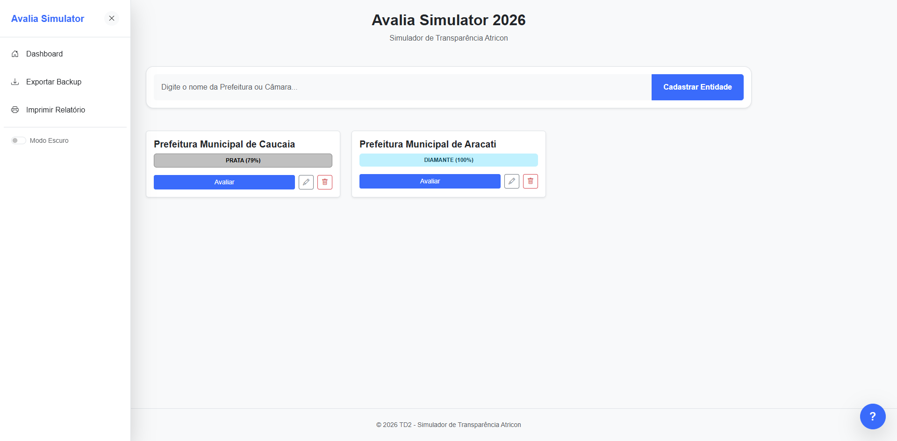

# 🏛️ Avalia Simulator 2026

![Interface do Simulador] 

O **Avalia Simulator** é uma ferramenta interativa desenvolvida para auxiliar municípios e órgãos públicos na simulação dos critérios de transparência estabelecidos pela **Atricon**. O sistema permite cadastrar entidades, realizar checklists detalhados e visualizar o progresso em tempo real, gerando selos de classificação baseados nos resultados.

## 🚀 Funcionalidades

- **Gestão de Entidades:** Cadastre, edite e exclua Prefeituras ou Câmaras de forma dinâmica.
- **Checklist Completo:** 19 grupos de critérios técnicos (Receitas, Despesas, Licitações, Saúde, Educação, etc.).
- **Cálculo em Tempo Real:** Barra de progresso e percentual atualizados instantaneamente.
- **Regra de Ouro:** Lógica integrada que limita o selo máximo (Prata, Ouro ou Diamante) caso itens **Essenciais (*)** possuam pendências.
- **Modo Escuro (Dark Mode):** Interface moderna com suporte a temas claro e escuro.
- **Exportação de Dados:** Função para baixar backup em formato JSON.
- **Relatório de Impressão:** Formatação otimizada para gerar relatórios em PDF ou papel diretamente do navegador.

## 🏆 Critérios de Selos

| Percentual | Nível de Transparência |
| :--- | :--- |
| **95% a 100%** | 💎 Diamante (Requer todos os Essenciais) |
| **85% a 94%** | 🥇 Ouro (Requer todos os Essenciais) |
| **75% a 84%** | 🥈 Prata (Requer todos os Essenciais) |
| **50% a 74%** | 🔵 Intermediário |
| **30% a 49%** | ⚪ Básico |
| **1% a 29%** | 🟡 Inicial |
| **0%** | ❌ Inexistente |

> **Nota:** Se houver falha em qualquer item marcado com **(*)**, o selo máximo permitido será **Elevado**, independentemente da nota percentual.

## 🛠️ Tecnologias Utilizadas

- **HTML5 & CSS3:** Estrutura responsiva e variáveis CSS para temas.
- **JavaScript (Vanilla):** Lógica de persistência, cálculos e manipulação de arrays.
- **Bootstrap 5:** Framework de UI para modais e grid system.
- **Bootstrap Icons:** Biblioteca de ícones vetoriais.
- **LocalStorage:** Armazenamento local para que os dados não sejam perdidos ao fechar o navegador.

## 📋 Como usar

1. **Cadastro:** Digite o nome da Prefeitura ou Câmara na tela inicial.
2. **Avaliação:** Clique em "Avaliar" para abrir o checklist daquela entidade.
3. **Preenchimento:** Marque as opções **G**ravação, **S**uficiência e **A**tualidade. Um item só é considerado "concluído" com as três opções marcadas.
4. **Edição:** Use o ícone do lápis ✏️ na tela inicial para renomear uma entidade.
5. **Backup:** Exporte seus dados periodicamente através do menu lateral.

## 💾 Instalação Local

```bash
# Clone o repositório
git clone [https://github.com/SEU-USUARIO/NOME-DO-REPOSITORIO.git](https://github.com/SEU-USUARIO/NOME-DO-REPOSITORIO.git)

# Acesse a pasta
cd NOME-DO-REPOSITORIO

# Abra o arquivo index.html no navegador
